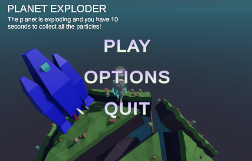
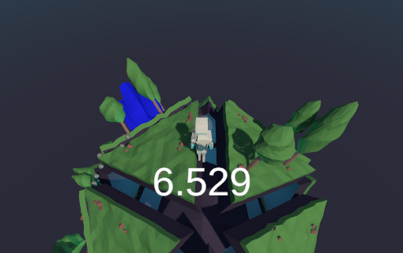
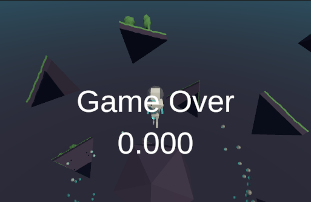

# Ludum Dare 51!

## Description
A short project for Ludum Dare 51. We plan on submitting in the "Extra" category.
This was developed over 3 days with relatively few hours put in.

## TODO
(David's todo ideas)

 **Gameplay:**
 - Add ability to collect particles
 - Add "Press F to enter rocket" prompt
 - Add visual cue that the planet is gonna blow up.
 - Add UI element: particles collected / total.
 - Add UI element: nicer timer?

 **Menu additions:**
 - ~~Main menu~~
 - ~~Options menu~~
 - Pause menu (main menu, resume)
 - Game over menu (Main menu, retry, quit)
 - Mute button toggle?

 **Misc:**
 - Rocket particle effects
 - Fix rocket clipping planet
 - Make the particles on the planet look cooler. Glowing spheres?

## Screenshots (Oct 3 2022)

Title screen

Gameplay

Game over state

:~)
